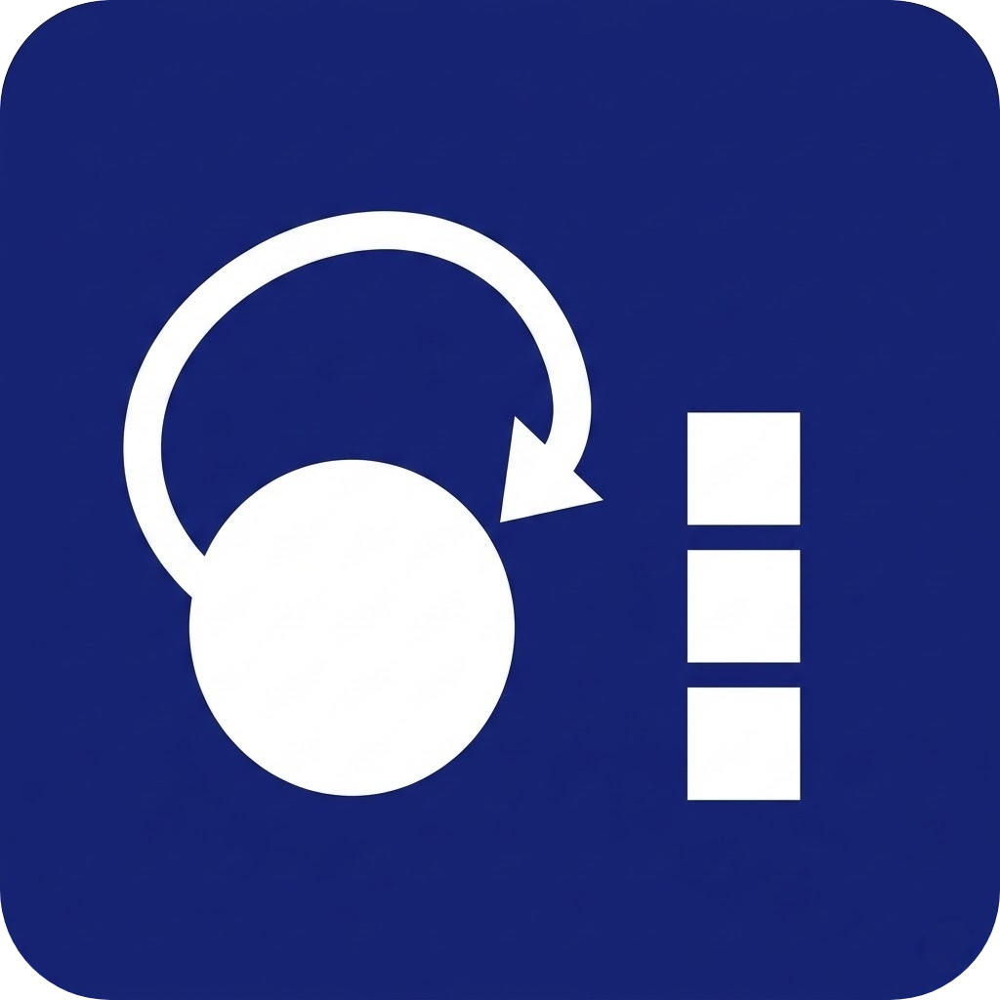
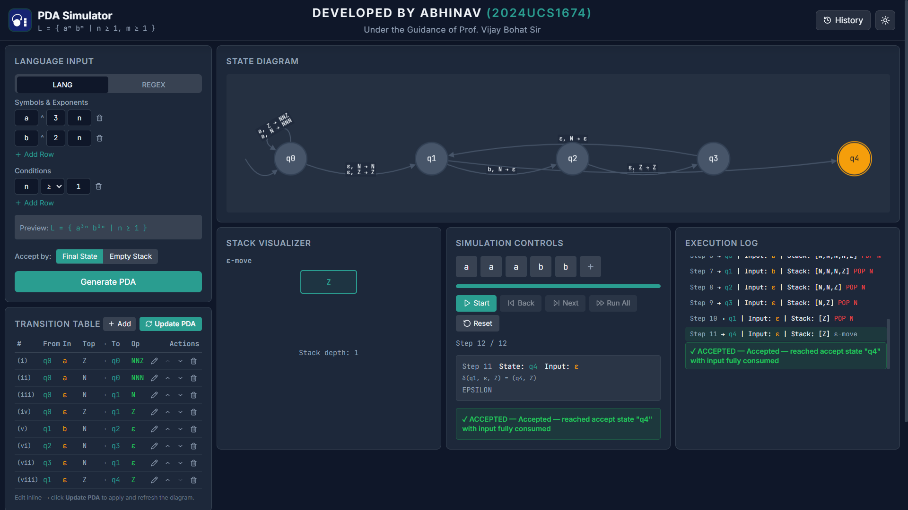
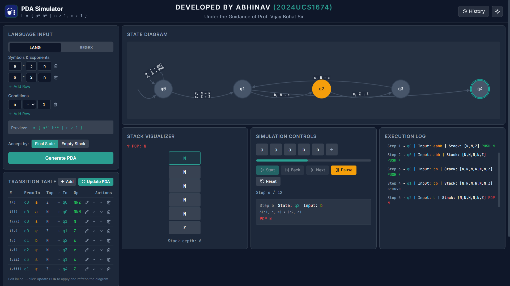

# Pushdown Automata (PDA) Simulator



## 🎯 Objective

The primary objective of this project is to provide a complete, interactive, and visual educational tool for understanding Pushdown Automata (PDA) and Context-Free Languages. Built with modern web technologies, the simulator empowers computer science students, educators, and language theory enthusiasts to easily model, visualize, and step through the behavior of pushdown automata in real-time.

## 🌐 Live Demo

Experience the application directly in your browser:  
👉 **[Launch Live Demo](https://pdasimulator.vercel.app/)**  

## 📸 Screenshots

*Demonstrating the interactive State Diagram and real-time Editable Transition Table:*

<p align="center">
  
  &nbsp;
  
</p>

---

## ✨ Features

- **Interactive State Diagram**: Visualize PDA states and transitions dynamically using Cytoscape.js.
- **Editable Transition Table**: Define states, input symbols, stack symbols, next states, and stack operations manually through an intuitive and reactive UI.
- **Language Generation Engine**: Automatically generate Pushdown Automata from formal languages or regular expressions using the built-in regex and PDA generator engines.
- **Step-by-Step Simulation**:
  - Step forward through the simulation.
  - Automatically play the simulation with playback controls.
  - Load test strings to see if they are accepted or rejected.
- **Real-Time Stack Visualizer**: Watch stack elements as they are modified (e.g., pushed, popped, replaced).
- **Detailed Execution Log**: A textual breakdown of the current state, remaining input, stack contents, and the specific transition applied during each step.
- **Pre-built Presets**: Instantly load canonical computing examples (like $0^n1^n$, palindromes, matched brackets) to jumpstart your learning.
- **Comprehensive History**: Keep track of previous simulation runs and revisit past language configurations.

## 🛠️ Tech Stack

- **Frontend Framework**: React 18
- **Build Tool**: Vite
- **Language**: TypeScript
- **Styling**: Tailwind CSS
- **UI Components**: Shadcn UI / Radix primitives
- **Graph Visualization**: Cytoscape.js
- **State Management**: React Context / Hooks (`use-pda`)
- **Icons**: Lucide React
- **Testing**: Vitest + React Testing Library

## 📂 Project Structure

```text
pushdown-automata-simulator/
├── public/                 # Static assets (logos, etc.)
└── src/
    ├── components/         # React Components
    │   ├── pda/            # Custom PDA UI components
    │   │   ├── EditableTransitionTable.tsx  # Interactive Transition CRUD 
    │   │   ├── ExecutionLog.tsx             # Step-by-step logger
    │   │   ├── InputTestingPanel.tsx        # String testing
    │   │   ├── LanguageInputPanel.tsx       # Parser/Generator input
    │   │   ├── SimulationControls.tsx       # Play/Pause/Step tools
    │   │   ├── StackVisualizer.tsx          # Graphical stack preview
    │   │   └── StateDiagram.tsx             # Visual Graph Representation
    │   └── ui/             # Reusable Shadcn UI components
    ├── hooks/              # Custom React Hooks (e.g., use-pda.tsx)
    ├── lib/                # Core Simulation Engine & Logic
    │   ├── pda-engine.ts     # Base automaton simulation logic
    │   ├── pda-generator.ts  # PDA translation utility
    │   ├── pda-presets.ts    # Premade PDAs for classic problems
    │   ├── pda-types.ts      # TypeScript interfaces and defaults
    │   └── regex-engine.ts   # Core engine for processing regex
    ├── pages/              # Application Routes (Index, NotFound)
    └── test/               # Unit and Integration Tests
```

## 🚀 Getting Started

### Prerequisites

- [Node.js](https://nodejs.org/) (v18 or higher recommended)
- `npm` (or `yarn` / `pnpm`)

### Installation

1. **Clone the repository:**
   ```bash
   git clone <repository-url>
   cd pushdown-automata-simulator
   ```

2. **Install dependencies:**
   ```bash
   npm install
   ```

3. **Start the development server:**
   ```bash
   npm run dev
   ```

4. Open your browser and navigate to the address shown in the terminal (usually `http://localhost:5173`).

## 📖 Usage Guide

1. **Define Language:** Enter a formal language pattern and specify constraints. Choose the Acceptance Mode (Final State or Empty Stack), then click *Generate PDA*.
2. **Review Components:** The platform will instantly generate and display the formal State Diagram alongside real-time Stack Visualization.
3. **Execute Simulation:** Validate strings using the Input Testing Panel. Control the step-wise execution flow via Simulation Controls (*Start*, *Next*, *Back*, *Run All*, *Reset*).
4. **Monitor State:** Trace the active states, input consumptions, and stack operations chronologically through the Execution Log.
5. **Refine Logic:** Modify or add custom transition rules within the Transition Table (edit mode) and click *Update PDA* to instantly reflect structural edits.

## 🧪 Testing

The repository uses `vitest` for running test suites.

```bash
# Run tests once
npm run test

# Run tests in watch mode
npm run test:watch
```

## 👨‍💻 Author & Credits

- **Developed by:** Abhinav (2024UCS1674)
- **Under the guidance of:** Prof. Vijay Bohat

Built as an interactive computer science utility to ease the understanding of Pushdown Automata and Context-Free Languages.